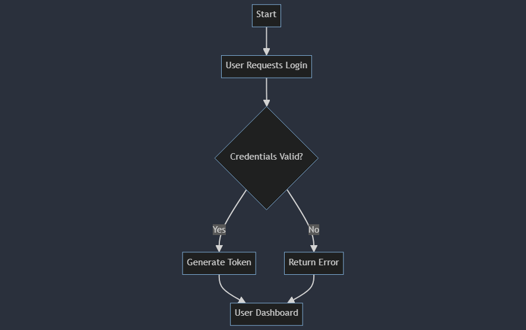
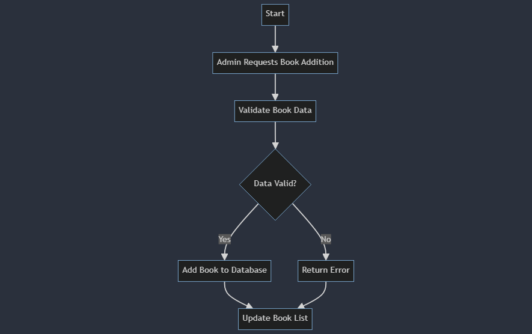
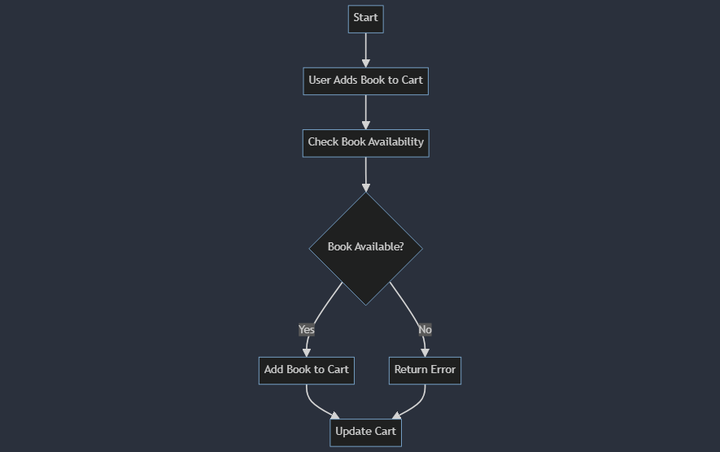
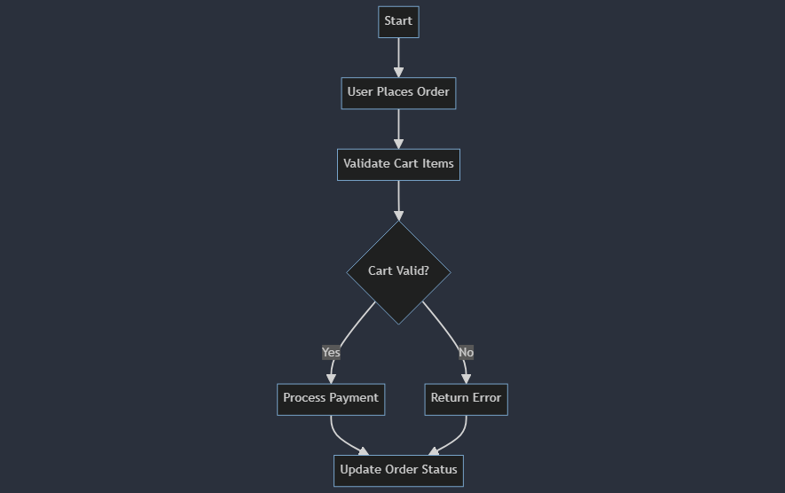
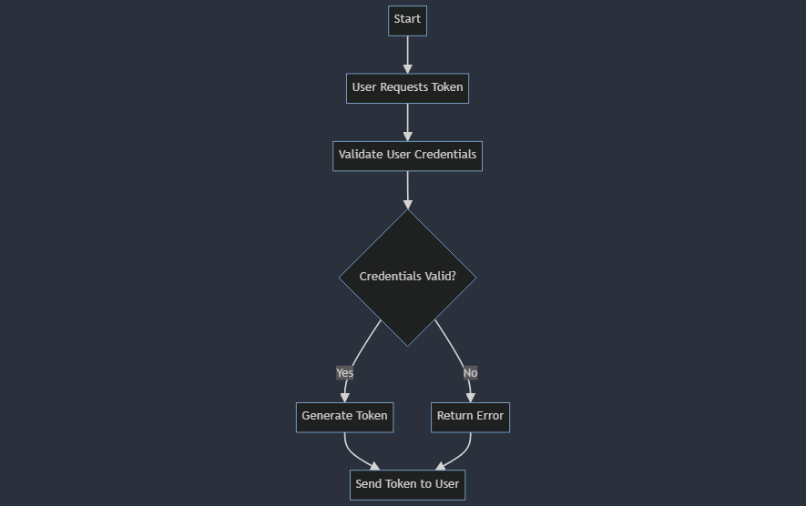
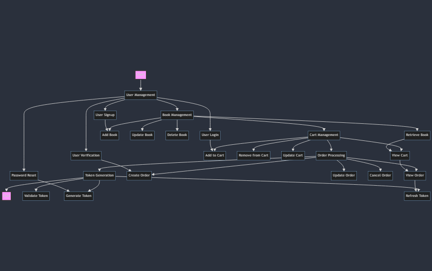

<link rel="stylesheet" type="text/css" href="style.css">

<!-- 
Author: Pirate-Emperor
Date: [Insert Date]
Description: README file for Librarium project.
-->

# Librarium

## Project Overview

Librarium is a Java-based application for managing book inventories, user accounts, and cart functionalities. Built with Java and Spring Boot using the MVC framework, it includes extensive testing to ensure reliability.

## Project Directory Structure

Here's an overview of the project directory structure and the purpose of each file and folder:

### Root Directory

- **`.mvn/`**: Contains Maven wrapper files for ensuring a consistent Maven environment.
  - **`wrapper/`**: Contains the Maven wrapper configuration file.
    - **`maven-wrapper.properties`**: Specifies Maven wrapper properties.

- **`.vscode/`**: Configuration files for Visual Studio Code (ignored in version control).

- **`Librarium/`**: Build output directory created by Maven.
  - **`target/`**: Compiled classes and JAR files.
    - **`classes/`**: Compiled class files.
      - **`com/PirateEmperor/Librarium/`**:
        - **`controller/`**: Contains controller classes for handling HTTP requests.
        - **`httpHandlers/`**: Contains classes for handling HTTP request data.
        - **`model/`**: Contains model classes and repository interfaces.
        - **`service/`**: Contains service classes for business logic.
        - **`sqlHandlers/`**: Contains classes for SQL query handling.

- **`src/`**: Source code and resources directory.
  - **`main/`**:
    - **`java/`**:
      - **`com/PirateEmperor/Librarium/`**:
        - **`controller/`**:
          - **`RestAdminController.java`**: Handles admin-related REST API requests.
          - **`RestAuthenticatedController.java`**: Handles requests requiring authentication.
          - **`RestPublicController.java`**: Handles public-facing REST API requests.
        - **`httpHandlers/`**:
          - **`AccountCredentials.java`**: Data structure for account credentials.
          - **`AddressInfo.java`**: Data structure for address information.
          - **`BookQuantityInfo.java`**: Data structure for book quantity information.
          - **`CartInfo.java`**: Data structure for cart information.
          - **`EmailInfo.java`**: Data structure for email information.
          - **`OrderInfo.java`**: Data structure for order information.
          - **`PasswordInfo.java`**: Data structure for password information.
          - **`QuantityInfo.java`**: Data structure for quantity information.
          - **`RoleVerificationInfo.java`**: Data structure for role verification information.
          - **`SignupCredentials.java`**: Data structure for signup credentials.
          - **`TokenInfo.java`**: Data structure for token information.
        - **`model/`**:
          - **`Book.java`**: Entity class for books.
          - **`BookRepository.java`**: Repository interface for book operations.
          - **`Cart.java`**: Entity class for carts.
          - **`CartBook.java`**: Entity class for cart-book associations.
          - **`CartBookKey.java`**: Composite key for cart-book associations.
          - **`CartBookRepository.java`**: Repository interface for cart-book operations.
          - **`CartRepository.java`**: Repository interface for cart operations.
          - **`Category.java`**: Entity class for categories.
          - **`CategoryRepository.java`**: Repository interface for category operations.
          - **`Order.java`**: Entity class for orders.
          - **`OrderRepository.java`**: Repository interface for order operations.
          - **`User.java`**: Entity class for users.
          - **`UserRepository.java`**: Repository interface for user operations.
        - **`service/`**:
          - **`AuthenticationService.java`**: Service for authentication-related operations.
          - **`BookService.java`**: Service for book-related operations.
          - **`CartService.java`**: Service for cart-related operations.
          - **`CategoryService.java`**: Service for category-related operations.
          - **`CommonService.java`**: Service for common operations.
          - **`MailService.java`**: Service for email operations.
          - **`OrderService.java`**: Service for order-related operations.
          - **`UserDetailServiceImpl.java`**: Service for user details management.
          - **`UserService.java`**: Service for user-related operations.
        - **`sqlHandlers/`**:
          - **`BookInCurrentCart.java`**: SQL handler for books in the current cart.
          - **`QuantityOfCart.java`**: SQL handler for cart quantities.
          - **`RawBookInfo.java`**: SQL handler for raw book information.
          - **`Sales.java`**: SQL handler for sales data.
          - **`TotalOfCart.java`**: SQL handler for cart totals.
        - **`AuthenticationFilter.java`**: Filter for authentication-related tasks.
        - **`AuthEntryPoint.java`**: Handles unauthorized access attempts.
        - **`MybooklistApplication.java`**: Main application class.
        - **`Scheduler.java`**: Scheduler for periodic tasks.
        - **`SecurityConfig.java`**: Security configuration class.
        - **`UserProfile.java`**: Handles user profile-related operations.
    - **`resources/`**:
      - **`application.properties`**: Configuration file for Spring Boot.

  - **`test/`**:
    - **`java/`**:
      - **`com/PirateEmperor/Librarium/`**:
        - **`authtest/`**:
          - **`RestAdminControllerTest.java`**: Tests for admin-related REST API endpoints.
          - **`RestAuthenticatedControllerTest.java`**: Tests for authenticated REST API endpoints.
          - **`RestPublicControllerTest.java`**: Tests for public REST API endpoints.
        - **`repotest/`**:
          - **`BookRepositoryTest.java`**: Tests for book repository operations.
          - **`CartBookRepositoryTest.java`**: Tests for cart-book repository operations.
          - **`CartRepositoryTest.java`**: Tests for cart repository operations.
          - **`CategoryRepositoryTest.java`**: Tests for category repository operations.
          - **`OrderRepositoryTest.java`**: Tests for order repository operations.
          - **`UserRepositoryTest.java`**: Tests for user repository operations.
        - **`AppTests.java`**: General application tests.

- **`.gitignore`**: Specifies files and directories to be ignored by Git.

- **`mvnw`**: Maven wrapper script for Unix-based systems.

- **`mvnw.cmd`**: Maven wrapper script for Windows.

- **`pom.xml`**: Maven project configuration file.

- **`README.md`**: This README file.

## Flow Charts

### 1. User Management Flow


### 2. Book Management Flow


### 3. Cart Management Flow


### 4. Order Processing Flow


### 5. Token Generation Flow


### 6. Combined Flow


## SDLC

The Software Development Life Cycle (SDLC) for Librarium includes:

1. **Requirements Analysis**: Understanding and documenting the requirements for managing books, users, carts, and orders.
2. **Design**: Creating system architecture, flowcharts, and detailed design documents.
3. **Implementation**: Coding the application using Java and Spring Boot with MVC architecture.
4. **Testing**: Conducting unit and integration tests to ensure the application functions as expected.
5. **Deployment**: Deploying the application to a server or cloud environment.
6. **Maintenance**: Monitoring, bug fixing, and updating the application based on user feedback.

## Highlight Testing Scripts

Testing is a critical part of the Librarium project to ensure functionality and reliability:

- **`RestAdminControllerTest.java`**: Validates the functionality of admin endpoints, including user management and cart operations.
- **`RestAuthenticatedControllerTest.java`**: Ensures correct behavior of endpoints that require user authentication.
- **`RestPublicControllerTest.java`**: Tests public-facing endpoints, focusing on book retrieval and cart management.
- **`BookRepositoryTest.java`**: Checks CRUD operations on the Book repository.
- **`CartBookRepositoryTest.java`**: Tests operations related to the CartBook repository.
- **`CartRepositoryTest.java`**: Validates CRUD operations for the Cart repository.
- **`CategoryRepositoryTest.java`**: Ensures proper functionality of the Category repository.
- **`OrderRepositoryTest.java`**: Tests the Order repository's CRUD operations.
- **`UserRepositoryTest.java`**: Validates user-related repository operations.
- **`AppTests.java`**: General application tests for various functionalities.

Testing ensures that each component works as expected and integrates correctly with others.

## Skills Used

- **Java**: Primary programming language.
- **Spring Boot**: Framework for building the application.
- **JUnit 5**: Testing framework used for unit tests.
- **MockMvc**: Used for testing Spring MVC controllers.

Here’s the single markdown file for the "Steps to Run" section:

## Steps to Run

Follow these steps to set up and run the Librarium project:

### 1. Clone the Repository

Clone the repository using Git:

```bash
git clone https://github.com/Pirate-Emperor/Librarium.git
```

### 2. Set JAVA_HOME Environment Variable

Ensure that the `JAVA_HOME` environment variable is set to the JDK/JRE version specified in the `pom.xml` file. You can either download the required version or select it from your environment list.

- **Download JDK/JRE**: [Download JDK/JRE](https://www.oracle.com/java/technologies/javase-jdk11-downloads.html)
- **Set JAVA_HOME**:

  - **Windows**:
    1. Open Command Prompt and set the environment variable:
       ```bash
       setx JAVA_HOME "C:\path\to\jdk"
       ```
    2. Verify the setting:
       ```bash
       echo %JAVA_HOME%
       ```

  - **macOS/Linux**:
    1. Edit your shell configuration file (`.bashrc`, `.bash_profile`, `.zshrc`, etc.) and add:
       ```bash
       export JAVA_HOME=/path/to/jdk
       ```
    2. Apply the changes:
       ```bash
       source ~/.bashrc
       ```

### 3. Create Maven Wrapper

Generate the Maven Wrapper files:

```bash
mvn wrapper:wrapper
```

### 4. Perform Clean and Install Phases

Build the project by cleaning and installing dependencies:

```bash
mvnw.cmd clean install
```

### 5. Run the Backend API

Start the Spring Boot application:

```bash
mvnw spring-boot:run
```

### 6. Check the Application

Open your browser and navigate to:

```
http://localhost:8080
```

### 7. Use Postman for API Testing

Use Postman or any API client to make calls to the above URL and test the various endpoints.

- **Download Postman**: [Get Postman](https://www.postman.com/downloads/)

Example API calls you can make:

- **GET** `/api/books` - Retrieve the list of books.
- **POST** `/api/cart` - Add an item to the cart.
- **PUT** `/api/orders/{orderId}` - Update an existing order.
- **DELETE** `/api/books/{bookId}` - Delete a book from the inventory.

Feel free to explore the API endpoints and verify the functionality of the application.

## Contributing

Feel free to fork the repository, make changes, and submit pull requests. Contributions are welcome!

## License

This project is licensed under the MIT License. See the [LICENSE](LICENSE) file for details.

## Author

**Pirate-Emperor**

[](https://twitter.com/PirateKingRahul)
[](https://discord.com/users/1200728704981143634)
[](https://www.linkedin.com/in/piratekingrahul)

[](https://www.reddit.com/u/PirateKingRahul)
[](https://medium.com/@piratekingrahul)

- GitHub: [Pirate-Emperor](https://github.com/Pirate-Emperor)
- Reddit: [PirateKingRahul](https://www.reddit.com/u/PirateKingRahul/)
- Twitter: [PirateKingRahul](https://twitter.com/PirateKingRahul)
- Discord: [PirateKingRahul](https://discord.com/users/1200728704981143634)
- LinkedIn: [PirateKingRahul](https://www.linkedin.com/in/piratekingrahul)
- Skype: [Join Skype](https://join.skype.com/invite/yfjOJG3wv9Ki)
- Medium: [PirateKingRahul](https://medium.com/@piratekingrahul)

Thank you for visiting the Librarium project!
---

For more details, please refer to the [GitHub repository](https://github.com/PirateEmperor/Librarium).

